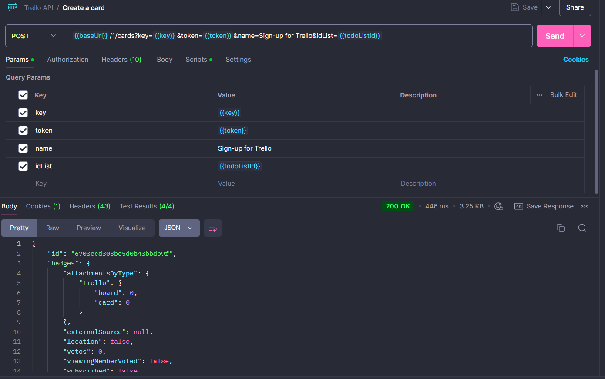
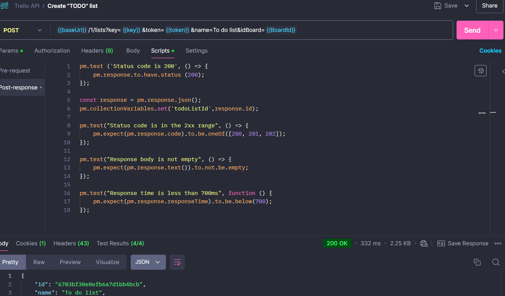

# Trello API Testing with JavaScript (Part 1)

## Project Overview:
This repository demonstrates Trello API testing using Postman and JavaScript. It contains a Postman collection, test scripts, and screenshots of the requests/responses, along with the manual results after executing the collection.

In September 2024, I completed an API Automation course focused on JavaScript and Postman. This project represents the manual testing phase of the Trello API before moving on to automation with CI/CD pipeline.

 ----------------------

- #### Start Date: September 2024
- #### End Date: October 2024

## API Under Test: Trello API

## Tools Used:
- **Postman**: For testing API endpoints using JavaScript to define test cases.
- **Node.js**: Required for JavaScript-based test scripts within Postman.
- **Postman Collection**: This will include the manual testing scenarious for the Trello Api endpoints.

#### Note: This repository focuses on manual testing with JavaScript language.
#### Automation is be covered in the next repository: Trello-API-Automation-with-CI-CD-Part2.

## Setting Up Trello API Integration
To test the endpoints in this collection, you will need a Trello account. You can [Sign up for free]( https://trello.com/)
1. To authenticate your API requests, you need to generate a Trello API Key and Token:
   - [How to get Trello API Key](https://developer.atlassian.com/cloud/trello/guides/rest-api/authorization/)

 ## Endpoints used with HTTP Method:

| HTTP Method | Endpoint Description      | API Documentation Link                                               |  
|-------------|---------------------------|---------------------------------------------------------------------|
| POST        | Create board              | [Trello API - Create Board](https://developer.atlassian.com/cloud/trello/rest/api-group-boards/#api-boards-id-post) |
| GET         | Get all Boards            | [Trello API - Get Boards](https://developer.atlassian.com/cloud/trello/rest/api-group-boards/#api-boards-get)  |
| GET         | Get single Board          | [Trello API - Get Board](https://developer.atlassian.com/cloud/trello/rest/api-group-boards/#api-boards-id-get)  |
| POST        | Create To Do list         | [Trello API - Create List](https://developer.atlassian.com/cloud/trello/rest/api-group-lists/#api-lists-id-post)  |  
| POST        | Create Done list          | [Trello API - Create List](https://developer.atlassian.com/cloud/trello/rest/api-group-lists/#api-lists-id-post)  |  
| POST        | Create a Card             | [Trello API - Create Card](https://developer.atlassian.com/cloud/trello/rest/api-group-cards/#api-cards-id-post)  |  
| PUT         | Update card               | [Trello API - Update Card](https://developer.atlassian.com/cloud/trello/rest/api-group-cards/#api-cards-id-put)  | 
| DELETE      | Delete a Board            | [Trello API - Delete Board](https://developer.atlassian.com/cloud/trello/rest/api-group-boards/#api-boards-id-delete) |  
| GET         | Get a deleted Board       | [Trello API - Get Deleted Board](https://developer.atlassian.com/cloud/trello/rest/api-group-boards/#api-boards-id-get) | 

## Postman Collection Overview:
This repository contains the **Trello API Oct.2024.postman_collection.json**, designed for manual testing of Trello API endpoints using various HTTP methods. JavaScript scripts in Postman utilize variables to efficiently handle query and path parameters.

## Test Validation:
**The scripts validate**:
- Status codes (e.g., 200 OK).
- Response body accuracy.
- Response time and basic performance.
- Analysis of API responses and test results.

## Content:
**A)** Successful API Test Run Manually (Oct. 2024)

**B)** Request/Response using HTTP Methods

**C)** Basic JavaScript test scripts for Trello endpoints in Postman

### Goal:
The primary focus is on manual API testing with Postman, using JavaScript to validate API responses.

## Test results:
**A)** Successful API Test Run Manually Oct.2024
 
-------------------------------------------------------------------------
**B)** Request/Response using the HTTP Methods

- POST Request: Create a Board

       Response: 200 Ok Success for creating a single board.

- GET Request: Get all Boards

       Response: 200 Ok Success for getting all boards created previously.

- POST Request: Create a new List on a Board

       Response: 200 Ok Success for creating a "TO DO" list.

- POST Request: Create a new List on a Board

       Response: 200 Ok Success for creating a "DONE" list.

- POST Request: Create a Card

       Response: 200 Ok Success for creating a "Sign-up for Trello" cart.

- PUT request: Update a Card

       Response: 200 Ok Success for updating a "Done" list.

- DELETE request: Delete a Board.

       Response: 200 Ok Success for deleting a Board.

- GET Request: Get a Deleted board.

       Response: 404 Not Found Success for not finding the deleted board previously.

--------------------------

**C)** Basic JavaScript test scripts

## Final note:
 **Test Scope**: 
 - A set of 37 API tests was created, covering key features of the Trello API. These tests used various HTTP methods (GET, POST, PUT, DELETE) to ensure a thorough evaluation of the API.

**Test Results**: 
- All tests were successfully executed manually using Postman's built-in runner.

**Features Tested**:
- Understanding the Trello API documentation was crucial for this project. It provided clarity on query parameters and path variables, which were key to writing effective test scripts in JavaScript. This approach ensured thorough test coverage and successful results.

